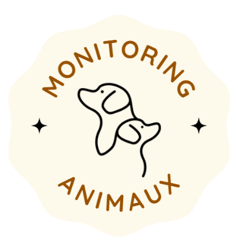

<div align="center">



# 🐾 Monitoring Animaux – Assistant Intelligent pour Animaux de Compagnie

Surveillez vos animaux à distance grâce à un système intelligent basé sur Raspberry Pi, caméras et synchronisation Google Drive.

<a rel="license" href="http://creativecommons.org/licenses/by-nc-nd/4.0/">
  
</a><br />
Ce projet est sous licence 
<a rel="license" href="http://creativecommons.org/licenses/by-nc-nd/4.0/">
  Creative Commons Attribution - NonCommercial - NoDerivatives 4.0 International
</a>.

---

</div>

## 📋 Sommaire

- [Présentation](#présentation)
- [Fonctionnalités](#fonctionnalités)
- [Architecture du Système](#architecture-du-système)
- [Installation et Préparation](#installation-et-préparation)
- [Exécution](#exécution)
- [Accès aux Vidéos](#accès-aux-vidéos)
- [Contributeurs](#contributeurs)

---

## 🐶 Présentation

**Monitoring Animaux** est un assistant intelligent conçu pour accompagner vos animaux domestiques lorsque vous êtes à distance (travail, voyage court, etc.).

Ce système basé sur **Raspberry Pi** enregistre des vidéos courtes en cas de détection d’activité, les stocke automatiquement sur **Google Drive**, et trace l'historique des actions.  

---

## ✅ Fonctionnalités

- Détection de mouvement via caméra
- Enregistrement vidéo (durée : 12 secondes)
- Lecture d’un son déclencheur (`son.mp3`)
- Stockage des vidéos sur Google Drive
- Enregistrement CSV des actions détectées
- Communication inter-machines via IP

---

## 🧱 Architecture du Système

Le projet repose sur une architecture distribuée :

- **Raspberry Pi** :
  - Détecte les mouvements
  - Lance l’enregistrement avec `picamera`
  - Envoie les vidéos et logs à l'ordinateur personnel

- **Ordinateur Personnel** :
  - Gère le transfert vers Google Drive (via API)
  - Organise les fichiers et l’historique
  - Synchronise les CSV avec les vidéos

📡 **Communication** :  
Les échanges entre Raspberry Pi et l'ordinateur personnel se font via **IP fixe** définie dans les scripts.

---

## ⚙️ Installation et Préparation

### 📁 Organisation des Fichiers

#### Sur **Raspberry Pi**
Placer dans `/home/pi/Projet/` :
```
Projet/
├── main.py
├── camera.py
├── son.mp3
├── historiqueAction.csv
└── Video/
```

#### Sur **Ordinateur Personnel**
Créer un dossier avec :
```
Ordinateur/
├── googlePratique.py
├── csvDrive.py
├── video.py
├── key.json
└── token.pickle
```

### 🔧 Modifications Nécessaires

Dans les fichiers suivants, modifier les adresses IP et chemins selon votre environnement :

- `camera.py` : IP + user de l’ordinateur perso + path
- `videoDrive.py` : chemin local
- `csvDrive.py` : IP de la Raspberry + chemin
- `googlePratique.py` : chemin local

> 📝 Suivre les commentaires dans les fichiers pour chaque modification à effectuer.

---

## 🚀 Exécution

1. Connecter et alimenter la **Raspberry Pi**
2. Le programme démarre automatiquement
3. En cas de problème avec Google (token expiré), suivez la **section 3.4 du manuel utilisateur** ou contactez les auteurs

---

## ☁️ Accès aux Vidéos

Les vidéos et historiques d’actions sont consultables sur Google Drive :

🔗 [Accéder au dossier partagé](https://drive.google.com/drive/folders/1CLgc7_7KY1TpCy4FMC1lKvnhNmA4isGh)

Si vous souhaitez synchroniser ces vidéos avec votre propre Drive, suivez la procédure dans le manuel (section 3.4) ou contactez l’équipe.

---

## 🤝 Contributeurs

- [**Jiayi He**](https://github.com/JiayiHE95)
- [**Lénaïs Desbos**](https://github.com/lenais-desbos)
